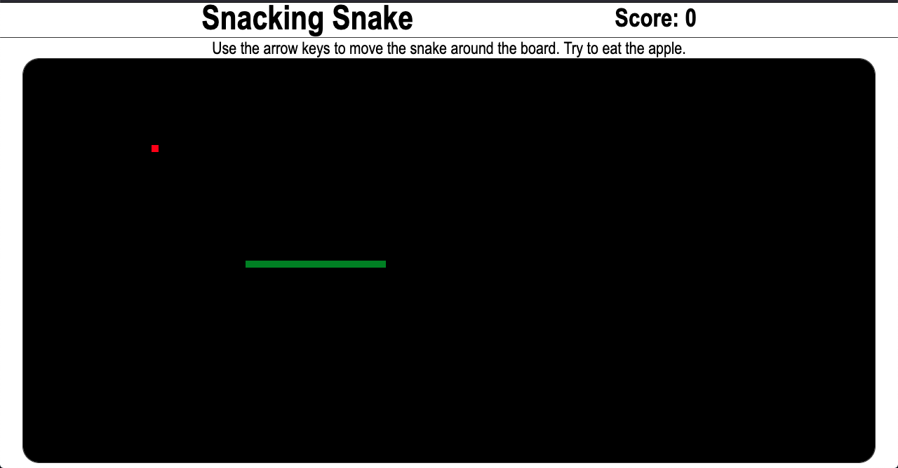

# APPLICATION #5: SNAKE GAME

## A JavaScript game using HTML Canvas.

[Play the game!!!](https://skillitzimberg.github.io/snake-game/).  

## Summary

This the fifth app on my roadmap part of the Software Development Mastermind program. This was my introduction to the Canvas API. I'm curious to see how this comes into play outside of games. What I really like about this project was getting to go deeper on object-oriented programming.

The expectations for the project are described in [DELIVERABLES](./DELIVERABLES.md).

The steps I took and other errata encountered while building are in [PLANNING](./PLANNING.md). I tried my best to have the commits track closely with this document.

## Author

Scott Bergler :: Full Stack Developer > [LinkedIn](https://www.linkedin.com/in/scott-bergler/) | [Personal Website](https://oceancode.dev/)
